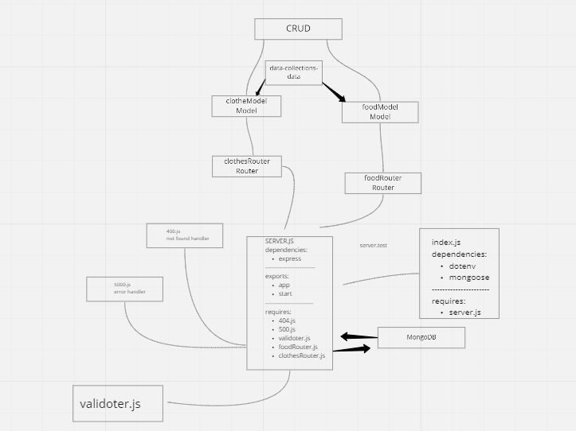

# api-server-v2

**Heroku app link:** [https://api-server-v2-amro.herokuapp.com/api/v1/food](https://api-server-v2-amro.herokuapp.com/api/v1/food)

**GitHub actions link:** [https://github.com/amroalbarham/api-server-v2/actions](https://github.com/amroalbarham/api-server-v2/actions)

**Pull Rrequest link:** [https://github.com/amroalbarham/api-server-v2/pull/5](https://github.com/amroalbarham/api-server-v2/pull/5)

***a basic api server that has a models and data collection class.  5 requeste to each model to deomnstrate a crud app with rest methods and mimick a data base along with some middleware. it integrated CI testing.***

